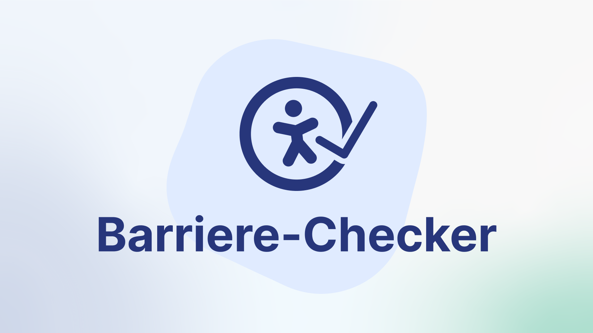
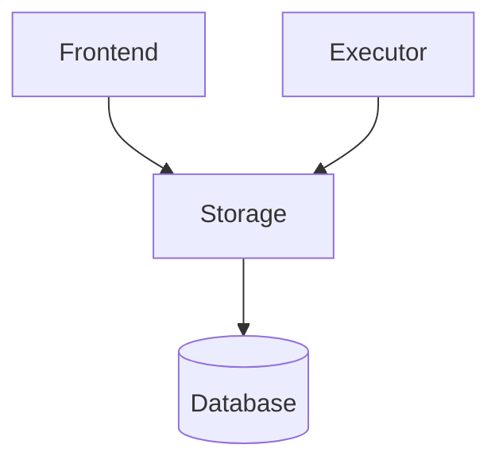

# Accessibility-Checker – mStudio Extension



## Overview

The Barrier Checker checks your website against the WCAG criteria and makes
existing barriers visible – including concrete solution tips. The accessibility
score provides information about the degree of accessibility.

The tool is implemented as an
[extension](https://developer.mittwald.de/docs/v2/contribution/overview/extensions/)
for [mittwald mStudio](https://www.mittwald.de/mstudio). A deeper integration in
the mStudio context, like semi-automatic configuration for hosted apps, is
planned but not yet implemented.

### Terms

- **Context** \
  The [extension context](https://developer.mittwald.de/docs/v2/contribution/glossary/#extension-context)s
  the extension is added to
- **ScanProfile**\
  A scan profile defines the configuration of scans scheduled for this profile.
  In the profile the domain, it’s paths and other settings for the scans are
  stored. A profile always is linked to a context.
- **Scan**\
  A scan to be executed (`scheduled`) or finished. Scans are scheduled based on
  a scan profile either cron based or manually by the user.
- **ScanResult**\
  The result of an executed scan consists of two parts:
  - Score: An overall accessibility score of the website and its pages. (Value
    between 0 and 100)
  - Issues: A list of issues found during the scan categorized in 3 severities:
    Error, Warning and Notice
- **ScanEngine**\
  The tool used to scan a website, find issues and calculate the accessibility
  score. Currently only one engine is implemented, but more might be added in
  the future.

## Concept / Architecture

The project is split into three packages with two of them being executables:

- **Frontend**\
  The user interface implemented to work as
  [front fragments for mStudio](https://developer.mittwald.de/docs/v2/contribution/overview/concepts/frontend-development/#frontend-fragments)
  and API routes for extension webhooks
- **Executor**\
  reads scheduled scans, executes them using a scan engine and stores the scan
  results in the database
- **Storage**\
  Shared package used by the executor and frontend containing model
  implementations



### Frontend App

The frontend app provides
[front fragments for mStudio](https://developer.mittwald.de/docs/v2/contribution/overview/concepts/frontend-development/#frontend-fragments)
to create and manage scan profiles, schedule manual scans and view scan results
with links to provide help to fix the issues. It also provides API routes for
extension webhooks.

It is implemented using [TanStack Start](https://tanstack.com/start/latest) and
uses mittwald [Flow Design System](https://mittwald.github.io/flow/).

### Executor

The executor is a NodeJs app. It periodically reads scheduled scans from the
database and executes them using a scan engine. It stores the scan results in
the database. It is designed to be horizontally scalable in a kubernetes
environment.

Currently, the only scan engine implemented uses
[Pa11y](https://github.com/pa11y/pa11y) to run accessibility tests on websites
and [Lighthouse](https://github.com/GoogleChrome/lighthouse) to calculate the
accessibility score. It uses
[NodeJS child processes](https://nodejs.org/api/child_process.html) to run
Lighthouse scans in parallel.

### Storage

The storage models are implemented using
[typegoose](https://typegoose.github.io/typegoose/), a TypeScript wrapper for
the mongoose library. The data is stored in a MongoDB database.

## Development

NodeJS dependencies are managed using [yarn](https://yarnpkg.com/). Make sure
[NodeJS](https://nodejs.org/en) v22 or higher is installed. Run `yarn install`
to install the dependencies.

### Preparation

#### MongoDB

Start a mongodb instance, i.e. by running:

```shell
docker compose up -d mongo
```

#### Environment variables

If the mongodb instance is not running on `localhost:27017` you need to adjust
the `start` script in `packages/executor/package.json` accordingly.

Create a `.env` file in the `packages/web2` directory and add the following:

```dotenv
MONGODB_URI="mongodb://localhost:27017/extension-a11y-checker"
NODE_ENV="development"

MITTWALD_KEY_PROVIDER_API_URL="http://localhost:8080/"
EXTENSION_SECRET="mwes-..."
```

#### Test context

The extension must be added to a context already. Make sure your context is
inserted in the database collection. Add it if necessary. Replace `:contextId`
with the context id. (In the production environment, this is done by the
[lifecycle webhook](https://developer.mittwald.de/docs/v2/contribution/overview/concepts/lifecycle-webhooks/#extensionaddedtocontext),
but it’s easier to fake this during development.)

```shell
docker exec mongodb mongosh extension-a11y-checker \
  --eval 'db.contexts.insertOne({ "_id": ":contextId", "name": "Test", "createdAt": new Date(), "updatedAt": new Date() })'
```

### Start the dev environment

In the root directory of the project run:

```shell
yarn dev
```

This will start the frontend app and the executor in watch mode. The frontend
app uses hot module reloading, so changes will be immediately visible. The
executor is recompiled and restarted automatically when the code changes. When
changes on the model classes are made, frontend and executor need to be
restarted manually.

Alternatively you can start the frontend and executor separately by running
`yarn dev` in each package directory.

### Load the frontend fragments

To load the extension frontend fragments from a local dev server, mStudio needs
to know the URL. Open the mStudio in your browser and in the browser console
execute:

```js
localStorage["mstudio/fragment-dev-url"] =
  "http://localhost:3000/?contextId=:contextId";
```

This tells mStudio to load all extension frontend fragments from this URL. Read
[notes on frontend fragment development](https://developer.mittwald.de/docs/v2/contribution/overview/concepts/frontend-development/#frontend-fragments).

Note: Safari blocks unsecured local connections when loaded by a secured page
(mStudio). At the time of writing, there is no option to disable this.
Therefore, it’s recommended to use a chromium-based browser during development.
